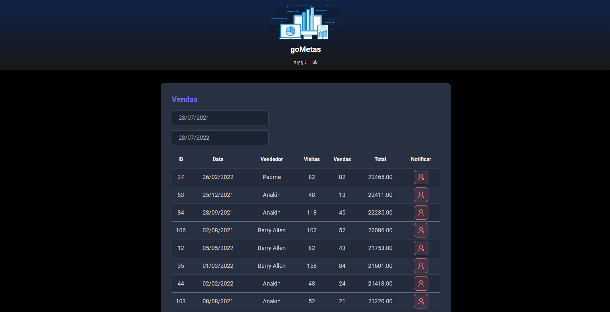

# <a href="https://gometas.netlify.app/" target="_blank">Projeto Go Metas</a>

## Tecnologias Utilizadas
<br>
<div style="display: inline_block">
    
    
    
    
    
    
    

</div>
<br>

#

## Licença vinculada ao repositório
[](https://github.com/LuizFernandoDeveloper/goMetas/blob/main/LICENSE)

#

## Sobre o projeto 

 ### Site com intuido de comunicar via sms com os colaboradores

  - Na pagina inicial podemos ver alguns colaboradores e suas vendas, podemos ver um botão para notificar o colaborador via sms
     
    #
  -  Nesse campo podemos selecionar a data que queremos analisar as vendas
     
     #
    - Projeto pode demorar para carregar serca de 5 minutos.

- Veja o projeto : <a href="https://gometas.netlify.app/" target="_blank">GoMetas</a>
#

## 💻 Pré-requisitos

Antes de começar, verifique se você atendeu aos seguintes requisitos:
<!---Estes são apenas requisitos de exemplo. Adicionar, duplicar ou remover conforme necessário--->
* Você deve instalar `<Java 11+ / STS / node / vit / vscode >`.
* Sistema operacional compatível: `<Windows / Linux / Mac>`.


## 🚀 Clone Critique seus Filmes

Para Clonar o Critique seus Filmes, siga estas etapas:

Linux e macOS:
```
git clone https://github.com/LuizFernandoDeveloper/Criticize-your-Films.git
```

Windows:
```
git clone https://github.com/LuizFernandoDeveloper/Criticize-your-Films.git
```


## 📫 Contribuindo para Critique seus Filmes

Para contribuir com Critique seus Filmes, siga estas etapas:

1. Bifurque este repositório.
2. Crie um branch: `git checkout -b <nome_branch>`.
3. Faça suas alterações e confirme-as: `git commit -m '<mensagem_commit>'`
4. Envie para o branch original: `git push origin <nome_do_projeto> / <local>`
5. Crie a solicitação de pull.


## 🤝 Colaboradores

Agradecemos às seguintes pessoas que contribuíram para este projeto:

<table>
  <tr>
    <td align="center">
      <a href="#">
        <br>
        <sub>
          <b>Luiz Fernando Rodrigues</b>
        </sub>
      </a>
    </td>
   
 
</table>


[⬆ Voltar ao topo](https://github.com/LuizFernandoDeveloper/goMetas/tree/main)<br>

